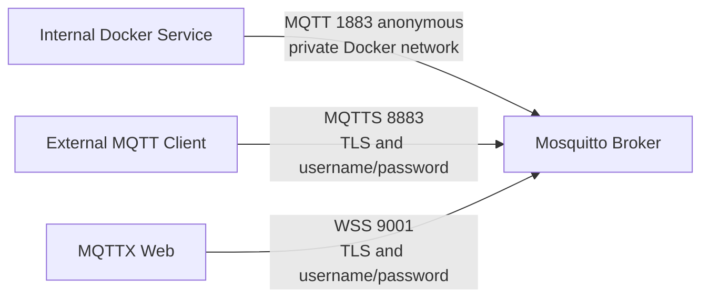

# mqtt-broker-stack

A Docker Compose-based commercial MQTT Broker deployment stack built around Eclipse Mosquitto.
Supports Docker, TLS, username/password authentication, ACL, and protocol-level healthchecks.

---

## Quick Start

```bash
# Clone and enter the repository
git clone https://github.com/j3camp/mqtt-broker-stack.git
cd mqtt-broker-stack

# Initialise (creates .env, development certificates, and admin user)
./scripts/init.sh

# Start the broker
make up

# Check broker health
make status
```

## Architecture

The broker provides two separate listeners:



| Listener | Port | TLS | Auth | Host Published |
|----------|------|-----|------|---------------|
| Internal | 1883 | No | No (anonymous) | **No** — Docker network only |
| External | 8883 | Yes | Username + password | Yes |
| WebSocket (optional) | 9001 | Yes | Username + password | Optional |

> ⚠️ Port 1883 is safe **only** within a trusted private Docker network.
> Untrusted containers must not join the `mqtt-internal` network.

## User Management

```bash
# Create user
./scripts/create-user.sh <username>

# Change password
./scripts/change-password.sh <username>

# Delete user
./scripts/delete-user.sh <username>
```

## ACL Management

```bash
# Create an ACL file (see mosquitto/config/security/acl.example)
cp mosquitto/config/security/acl.example mosquitto/config/security/acl

# Enable ACL
./scripts/enable-acl.sh

# Disable ACL
./scripts/disable-acl.sh
```

## Certificate Management

Development certificates are generated automatically by `./scripts/init.sh`.

For a specific hostname:

```bash
./scripts/generate-cert.sh --hostname mqtt.example.com --ip 192.168.1.10
```

> ⚠️ Self-signed certificates are for development only.
> Use a trusted CA for production.

## Optional MQTTX Web Console

MQTTX Web is an optional developer MQTT client console — not a broker administration tool.

```bash
docker compose -f compose.yaml -f compose.console.yaml up -d
```

Access at `http://localhost:80`. Use it for topic inspection and connection testing only.

## Backup and Restore

```bash
# Create a backup
./scripts/backup.sh

# Restore from backup
./scripts/restore.sh backups/mqtt-broker-backup-<timestamp>.tar.gz
```

## Validation and Testing

```bash
# Validate configuration
make validate

# Run integration tests
make test
```

## Documentation

- [Architecture](docs/architecture.md)
- [Security](docs/security.md)
- [Configuration](docs/configuration.md)
- [Operations](docs/operations.md)
- [MQTT Administration Console Decision](docs/admin-console/README.md)

## Production Checklist

- [ ] Replace self-signed certificates with trusted CA certificates
- [ ] Set strong passwords for all MQTT users
- [ ] Configure `MQTT_TLS_BIND_ADDRESS` appropriately
- [ ] Verify port 1883 is never published to the host
- [ ] Set up automated backups
- [ ] Monitor broker logs
- [ ] Keep Mosquitto image version pinned and up-to-date
