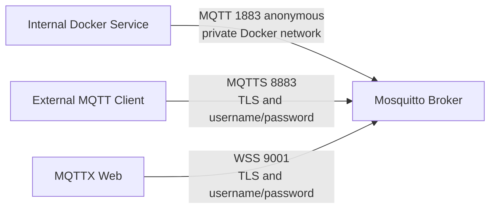

# Architecture

## Overview

`mqtt-broker-stack` is a Docker Compose-based deployment of Eclipse Mosquitto with two separate listeners:

- **Internal listener** (port 1883): Plaintext MQTT for trusted Docker services only
- **External listener** (port 8883): MQTT over TLS requiring username and password

## Trust Boundaries

| Zone | Access Method | Trust Level |
|------|--------------|-------------|
| Docker private network (`mqtt-internal`) | Plain MQTT port 1883, anonymous | Trusted — Docker-internal only |
| External network | MQTTS port 8883, TLS + credentials | Untrusted — enforce auth and TLS |

### Important Warnings

- Port 1883 is safe **only** within a trusted private Docker network.
- **Untrusted containers must not join the `mqtt-internal` network.**
- This design is **not** a complete Zero Trust architecture.
- Self-signed certificates are intended for development or controlled environments.
- Public production services should use an appropriate enterprise PKI or trusted CA.

## Network Design

The broker is connected to a single private Docker bridge network (`mqtt-internal`). Containers that need to use the internal MQTT listener must be added to this network. Port 1883 is never published to the Docker host.

Port 8883 is published to the Docker host (configurable via `MQTT_TLS_BIND_ADDRESS` and `MQTT_TLS_PORT` in `.env`).

## Volume Design

| Mount | Mode | Purpose |
|-------|------|---------|
| `./mosquitto/config` | read-only | Mosquitto configuration |
| `./mosquitto/config/security` | read-write | Runtime password file and ACL |
| `./mosquitto/config/certs` | read-only | Server TLS certificates |
| `mosquitto-data` (named volume) | read-write | MQTT persistence data |
| `./mosquitto/scripts/healthcheck.sh` | read-only | Healthcheck script |

The CA private key (`certs/ca/ca.key`) is **never** mounted into the Mosquitto container.
