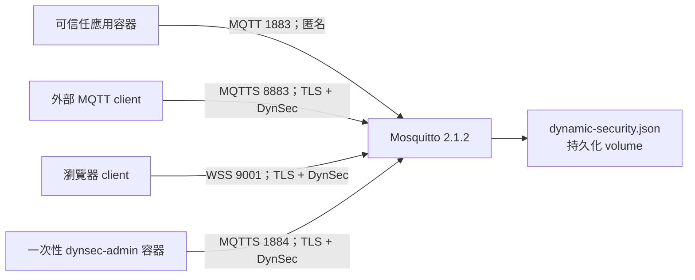

# 架構

## 元件

## 網路分區

- `mqtt-internal`：internal Docker bridge，只給可信任應用服務。1883 未發布到主機。
- `mqtt-control`：獨立 internal bridge，broker 固定使用 `172.31.0.2`。只有 `dynsec-admin` 工具容器加入，1884 未發布到主機。
- `mqtt-edge`：只有 broker 加入的非 internal bridge，提供 Docker published ports 所需的 edge 路徑；一般應用與管理工具不加入。
- 外部 MQTTS 透過可設定 bind address 的 8883 發布。
- WSS 9001 預設只綁 `127.0.0.1`，需要反向代理時仍應維持 TLS 與來源控管。

加入 `mqtt-internal` 的容器無法路由至固定綁在控制介面的 1884。一般服務不可加入 `mqtt-control`。

## Dynamic Security 載入模型

`mosquitto.conf` 以 `plugin_load dynsec` 載入一次並設定持久化檔；外部、WSS 與控制 listener 分別以 `plugin_use dynsec` 啟用。內部 listener 沒有 `plugin_use`，並明確設定 `listener_allow_anonymous true`。

專案不使用 Mosquitto 2.0 的 `per_listener_settings`、`password_file` 或 `acl_file`。這讓每個 listener 的匿名與 plugin 選擇直接寫在自己的區段，不依賴隱含的跨 listener 狀態。

## 管理控制面

`scripts/dynsec-command.sh` 啟動一次性、唯讀的管理容器。容器移除所有一般 capabilities，只加回讀取 host-owned mode 600 Compose file secret 所需的 `DAC_READ_SEARCH`，不具有 `DAC_OVERRIDE` 寫入繞過能力。容器透過 TLS 連線至 `mosquitto-control:1884`。Compose file secret 在 broker 啟動時會由 root entrypoint 複製成僅 `mosquitto` 使用者可讀的暫存檔，主機 secret 仍維持 mode 600。broker 或 Docker socket 都不會掛載到管理容器。

遷移與回復則使用無 network 的 helper，只能存取 Dynamic Security volume 與唯讀候選檔，並以同一檔案系統內的 atomic rename 替換狀態。
